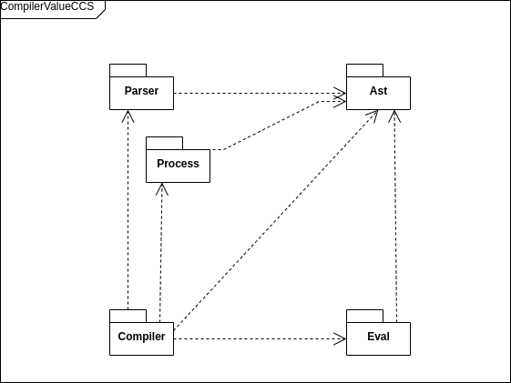

# CompilerValueCCS source overview

{ width=70% }

# Value Passing CCS Ast

\scriptsize
```scala
trait ValueCCS

case class Const(name: String, l: Option[List[Aexpr]]) extends ValueCCS
case class TauCh(p: ValueCCS) extends ValueCCS
case class InputCh(c: Channel, v: Option[Variable], p: ValueCCS) extends ValueCCS
case class OutputCh(c: Channel, e: Option[Aexpr], p: ValueCCS) extends ValueCCS
case class IfThen(b: Bexpr, p: ValueCCS) extends ValueCCS
case class Par(left: ValueCCS, right: ValueCCS) extends ValueCCS
case class Sum(l: List[ValueCCS]) extends ValueCCS
case class Restrict(p: ValueCCS, l: List[Channel]) extends ValueCCS
case class Redirection(p: ValueCCS, cs: List[(Channel, Channel)]) extends ValueCCS
```
\normalsize

# Value Passing CCS Grammar

e ::= e + e | e * e | n | ... \
b ::= e < e | e != e | b && b | ... \
\
P, Q ::= $\sum_{i\in I}P$ \
| $P\ |\ Q$ \
| $P\backslash L$ \
| $K(e_1,...,e_h)$ \
| $\mbox{if b then P}$ \
| $a(x).P$ \
| $'a(e).P$ \
| $\tau.P$ \
\

The parser handles things slightly differently

# The parser

Antlr4:

 - maintainable grammar
 - support for direct left recursion
 - easy implementation
 - (simpler than Parser Combinators!).

# The _actual_ grammar

## Boolean and Arithmetic expr grammar

Boolean and arithmetic expressions grammar avoid left recursion:

\footnotesize
```antlr4
// arithmetic expression
summation: SUM | SUB;
product: MUL | DIV;
expr: term (summation term)*;
term: factor (product factor)*;
factor: LBRACKET expr RBRACKET | IDENTIFIER | INTEGER;

// boolean expression
logicop: AND | OR;
boolop: LE | GE | GEQ | LEQ | EQUALS;
boolbinop: bterm (logicop bterm)*;
bterm: NOT boolbinop | exprbinop | LBRACKET boolbinop RBRACKET;
exprbinop: expr boolop expr;
```
\normalsize

---------------

## CCS value passing grammar

\scriptsize
```antlr4
constant: IDENTIFIER (LBRACKET IDENTIFIER (COMMA IDENTIFIER)* RBRACKET)? ;
ccsvp: 
// const
IDENTIFIER (LBRACKET expr (COMMA expr)* RBRACKET)?
// ifthen
| IF LBRACKET boolbinop RBRACKET THEN ccsvp
// restriction
| ccsvp RESTR CURLY_LBRACKET IDENTIFIER (COMMA IDENTIFIER)* CURLY_RBRACKET
// redirection
| ccsvp SQUARED_LBRACKET IDENTIFIER DIV IDENTIFIER 
            (COMMA IDENTIFIER DIV IDENTIFIER)* SQUARED_LBRACKET
//inputch
| IDENTIFIER (LBRACKET IDENTIFIER RBRACKET)? SEPARATOR ccsvp
//outputch
| OUT IDENTIFIER (LBRACKET expr RBRACKET)? SEPARATOR ccsvp
// tauch
| TAU SEPARATOR ccsvp
// sum
| ccsvp (SUM ccsvp)+
// par
| ccsvp PAR ccsvp
// parenthesis
| LBRACKET ccsvp RBRACKET
;
program: constant DEFINE ccsvp;
```

\normalsize

# Pure CCS Ast

```scala
enum PureCCS:
  case Constant(name: String)
  case TauCh(p: PureCCS)
  case InputCh(c: Channel, p: PureCCS)
  case OutputCh(c: Channel, p: PureCCS)
  case Par(left: PureCCS, right: PureCCS)
  case Sum(l: List[PureCCS])
  case Restrict(p: PureCCS, l: List[Channel])
  case Redirection(
    p: PureCCS, 
    cs: List[(Channel, Channel)])
```

# Compilation

## Evaluation

Arithmetic expressions:

```scala
def eval(
  a: Aexpr, 
  subst: Map[Variable, Natural]): Natural
```

Boolean expressions:

```scala
def eval(
  a: Bexpr, 
  subst: Map[Variable, Natural]): Boolean
```

-----------

### The `Natural` type

```scala
opaque type Natural = Int

object Natural:
  def apply(i: Int): Natural =
    require(i >= 0); i

extension (x: Natural)
  // arithmetic operators
  def +(y: Natural): Natural = x + y
  def -(y: Natural): Natural =
  // ...
```

------------------

## The compiler object

\small
```scala
object PureCCSCompiler:
  def apply(
      program: ValueCCSProcess,
      lowerBound: Int,
      upperInclBound: Int
  ): List[PureCCSProcess] =

    // builds all possible combinations of 
    // variables for each one runs compiler or
    // if there aren't any run compiler once.

```
\normalsize

------------------

## The compilation function

```scala
  private def translateProcess(
      src: V,
      natRange: Set[Int],
      subst: Map[Variable, Natural]
  ): P =
    src match
      case V.Constant(n, None) => //...
      case V.Sum(l) if l.isEmpty => //...
      case V.Par(left, right) => //...
      case V.Restrict(p, l) => //...
      case V.Redirection(p, cs) => //...
      case V.IfThen(b, p) 
        if evalB(b, subst) == true => //...
      // ...

```

# A few examples

 - Peterson:\

`K(x) = 'kr(x).K(x) + kw(y).K(y)`

 - Counter:\

`C(x) = inc.C(x + 1) + if x > 0 then dec.C(x - 1)`

 - (very) Hungry philosophers: 
    
```
Phil1 = 'takes(2) . eats . 'leaves(2) . Phil1(2)
Phil2 = 'takes(2) . eats . 'leaves(2) . Phil2(2)
...
C(x) = if x >= 2 then takes(y) . C(x - y) + leaves(y) . C(y)
Sys(x) = (Phil1 | Phil2 | C(x)) \ {takes, leaves}
```

-----------------

# References
