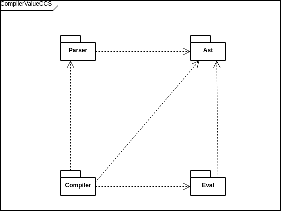

# CompilerValueCCS source overview

{ width=70% }

# Value Passing CCS Ast

\small

```scala
enum ValueCCS:
  case Constant(name: String, l: Option[List[Aexpr]])
  case TauCh(p: ValueCCS)
  case InputCh(c: Channel, v: Option[Variable], p: ValueCCS)
  case OutputCh(c: Channel, e: Option[Aexpr], p: ValueCCS)
  case IfThen(b: Bexpr, p: ValueCCS)
  case Par(left: ValueCCS, right: ValueCCS)
  case Sum(l: List[ValueCCS])
  case Restrict(p: ValueCCS, l: List[Channel])
  case Redirection(p: ValueCCS, cs: List[(Channel, Channel)])
```

\normalsize

# Value Passing CCS Grammar

e ::= e + e | e * e | n | ... \
b ::= e < e | e != e | b && b | ... \
\
P, Q ::= $\sum_{i\in I}P$ \
| $P\ |\ Q$ \
| $P\backslash L$ \
| $K(e_1,...,e_h)$ \
| $\mbox{if b then P}$ \
| $a(x).P$ \
| $'a(e).P$ \
| $\tau.P$ \
\

The parser handles things slightly differently

# The parser

Packrat Parsers:

  - needed left recursion
  - a DSL tightly integrated with Scala.

# The _actual_ grammar

```xml
<id>     ::= [a-zA-Z][a-zA-Z0-9_]
<Id>     ::= [a-z][a-zA-Z0-9_]
<number> ::= [1-9]\d*
```

Boolean and arithmetic expressions grammar avoid left recursion:

```xml
<expr>      ::= <term> [("+" | "-") <term> ]*
<term>      ::= <factor> [("*" | "/") <factor>]*
<factor>    ::= "(" <expr> ")" | <id> | <number>

<boolbinop> ::= <term> ("&&" | "||") <term>]*
<term>      ::= "!" <boolbinop> | <exprbinop> 
              | "(" <boolbinop> ")"
<exprbinop> ::= <expr> ("<" | ">" | ...) <expr>
```

---------------

\small
```xml
<const>  ::= <Id>( <expr>* ) | <Id>
<inch>   ::= <id> "(" <id> ")" "." <P> | <id> "." <Ppar>
<outch>  ::= "'" <id> "(" <expr> ")" "." <Ppar>
<tauch>  ::= "tau" "." <Ppar>
<ifthen> ::= "if" "(" <boolbinop> ")" "then" <PPar>
<sum>    ::= ( <par> | <rest> | <inch> | ... ) ("+" <P>)+
<par>    ::= (<sum> | <restr> | <inch> | ... ) "|" <P>
<restr>  ::= <Ppar> "{" ( <id>* ) "}"
<redr>   ::= <Ppar> "[" (<id> "/" <id>)* "]"

<Ppar>    ::= <outch> | <const> | <tauch> | <inch> | <ifthen> |
            | "(" (<sum> | <par> | <restr> | <redr>) ")"
<P>       ::= <sum> | <par> | <restr> | <inch> | ...
<program> ::= <const> "=" <P>
```

\normalsize

# Pure CCS Ast

```scala
enum PureCCS:
  case Constant(name: String)
  case TauCh(p: PureCCS)
  case InputCh(c: Channel, p: PureCCS)
  case OutputCh(c: Channel, p: PureCCS)
  case Par(left: PureCCS, right: PureCCS)
  case Sum(l: List[PureCCS])
  case Restrict(p: PureCCS, l: List[Channel])
  case Redirection(
    p: PureCCS, 
    cs: List[(Channel, Channel)])
```

# Compilation

## Evaluation

Arithmetic expressions:

```scala
def eval(
  a: Aexpr, 
  subst: Map[Variable, Natural]): Natural
```

Boolean expressions:

```scala
def eval(
  a: Bexpr, 
  subst: Map[Variable, Natural]): Boolean
```

-----------

### The `Natural` type

```scala
opaque type Natural = Int

object Natural:
  def apply(i: Int): Natural =
    require(i >= 0); i

extension (x: Natural)
  // arithmetic operators
  def +(y: Natural): Natural = x + y
  def -(y: Natural): Natural =
  // ...
```

------------------

## The compiler object

\small
```scala
object PureCCSCompiler:
  def apply(
      program: ValueCCSProcess,
      lowerBound: Int,
      upperInclBound: Int
  ): List[PureCCSProcess] =

    // builds all possible combinations of 
    // variables for each one runs compiler or
    // if there aren't any run compiler once.

```
\normalsize

------------------

## The compilation function

```scala
  private def translateProcess(
      src: V,
      natRange: Set[Int],
      subst: Map[Variable, Natural]
  ): P =
    src match
      case V.Constant(n, None) => //...
      case V.Sum(l) if l.isEmpty => //...
      case V.Par(left, right) => //...
      case V.Restrict(p, l) => //...
      case V.Redirection(p, cs) => //...
      case V.IfThen(b, p) 
        if evalB(b, subst) == true => //...
      // ...

```

# A few examples

 - Peterson:\

`K(x) = 'kr(x).K(x) + kw(y).K(y)`

 - Counter:\

`C(x) = inc.C(x + 1) + if x > 0 then dec.C(x - 1)`

 - (very) Hungry philosophers: 
    
```
Phil1 = 'takes(2) . eats . 'leaves(2) . Phil1(2)
Phil2 = 'takes(2) . eats . 'leaves(2) . Phil2(2)
...
C(x) = if x >= 2 then takes(y) . C(x - y) + leaves(y) . C(y)
Sys(x) = (Phil1 | Phil2 | C(x)) \ {takes, leaves}
```

-----------------

# References
